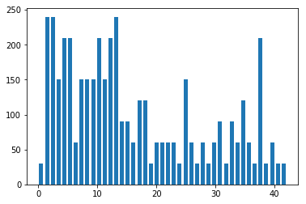
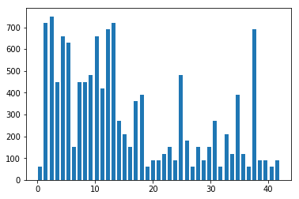
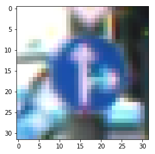
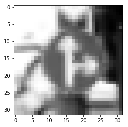
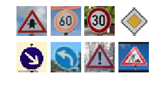

# Traffic Sign Recognition

## Data Set Summary & Exploration

### Basic summary

The dataset include 34799, 4410, and 12630 images in the training, validation and test set respectively. There are in total 43 unique classes/labels in the dataset.

### Exploratory visualization of the dataset
The following three visualizations plot the distriubtion of each data set. This shows that although there are some small differences, the distributions are rather similar. However, we do see that some classes have way more examples than others. Whether we need to generate some fake data to balance the dataset depends on the validation accuracy. 
#### Training data distribution

#### Validation data distribution

#### Test data distribution

## Design and Test a Model Architecture

### 1. Describe how you preprocessed the image data. What techniques were chosen and why did you choose these techniques? 

The techniques used are:

- Converting the images into grey scale. Intuitively the color in the images may not play an important role in the sign recognition problem. This also helps with the performance when no GPU is present.
- Normalization of the pixel data. This helps the traning process, specifically the gradient descent process in the backpropogation so it can train faster with less oscillations. 

#### Traffic Sign Original

#### Traffic Sign Grey Scale

#### Traffic Sign Grey Scale Normalized

### 2. Describe what your final model architecture looks like including model type, layers, layer sizes, connectivity, etc.) Consider including a diagram and/or table describing the final model.

The model chosen consisted of the following layers:
- Input Layer: 32 x 32 x 1 grey scale images
- 5 x 5 Convolution: 1 x 1 stride, valid padding, output 28 x 28 x 6
- ReLU
- 2 x 2 Max Pooling: 2 x 2 stride, valid padding, output 14 x 14 x 6
- 5 x 5 Convolution: 1 x 1 stride, valid padding, output 10 x 10 x 16
- ReLU
- 2 x 2 Max Pooling: 2 x 2 stride, valid padding, output 5 x 5 x 16
- Flatten: 400
- Fully Connected: output 400 x 120
- ReLu
- Drop out: keep prob 0.5
- Fully Connected: output 120 x 84
- ReLu
- Drop out: keep prob 0.5
- Fully Connected: output 84 x 43
- Softmax (Conceptually it should be here but in the code it is not implemented as part of the network archiecture)

### 3. Describe how you trained your model. The discussion can include the type of optimizer, the batch size, number of epochs and any hyperparameters such as learning rate.

The loss function chosen is the cross-entropy loss. We chose the Adam optimizer since it trains faster than pure Gradient Descent.

The configurations are as follows:
- Batch size: 128
- Epoch: 50
- Keep Prob: 0.5
- Learning rate: 0.001

### 4. Describe the approach taken for finding a solution and getting the validation set accuracy to be at least 0.93. 

#### Initial result
The initial model uses the same archiecture as that in the LeNet-5  model. It achieved 100% and 92% accuracy over the training and validation data set respectively. 

#### Adjusting the network
Since we have validated that the data distributions are similar among all 3 data sets, the most likely cause of the gap is the high variance of the model. This means that our network is overfitting the data. In order to fix this problem, two dropout layers are added into the network with a probability of 0.5 to keep a node alive in the network during training. 

The new network achieved 100% accuracy on the training network but 96.5% accuracy on the validation set, a 4 percent increase. Dropout layer forces the model not to depend on any neuron alone since it can be shut down randomly at any moment during training. This makes the model to distribute the weights more evenly (many smaller weights versus only a few big weights). 

The result is similar to L2 regularization that drives the weight smaller and prevent the model from overfitting. This relies on the assumption that models with smaller weights are simpler than one with larger weights. 

## Test a Model on New Images

### 1. Choose five German traffic signs found on the web and provide them in the report. For each image, discuss what quality or qualities might be difficult to classify.

The model classified all 8 images accurately with very high probability on the correct class.

### 2. Discuss the model's predictions on these new traffic signs and compare the results to predicting on the test set. At a minimum, discuss what the predictions were, the accuracy on these new predictions, and compare the accuracy to the accuracy on the test set.

Here are the results of prediction (Image label <-> Prediction):
- Right-of-way at the next intersection <-> Right-of-way at the next intersection
- Speed limit (60km/h) <-> Speed limit (60km/h)
- Speed limit (20km/h) <-> Speed limit (20km/h)
- Priority road <-> Priority road
- Keep right <-> Keep right
- Turn left ahead <-> Turn left ahead
- General caution <-> General caution
- Road work <-> Road work

The accuracy on the test set is around 93.7%, which is lower than what we have on these 8 predictions. However, we cannot simply compare these two results as the test set has many more images than 8. Such comparison would not be fair.

### 3. Describe how certain the model is when predicting on each of the five new images by looking at the softmax probabilities for each prediction. 

As discribed above, the model made the predictions with high certainty on each image provided with a minimum of 0.997 probability. Some even reached the probability of 1. To save some space we skip the probability table here.
